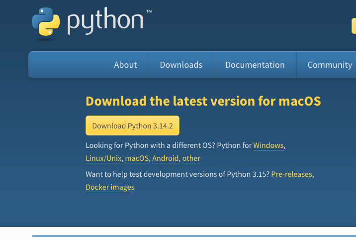

# Window 에서 python3 설치 방법

1. [Python 공식 사이트](https://www.python.org/downloads/) 에 접속합니다.
2. 
3. "Download Python 3.x.x" 버튼을 눌러 설치 파일을 다운로드 합니다.
4. 또는 [다운로드 링크](https://www.python.org/ftp/python/pymanager/python-manager-25.2.msix) 를 눌러 다운로드 프로그램을 설치합니다.
5. 설치 프로그램을 실행하고 y/N 질문이 나올 경우 y 로 설치를 합니다

# Window 에서 프로그램 실행 방법
1. input 폴더를 생성하고 그 안에 변환할 pdf 들을 넣습니다
2. run_convert.bat 파일을 더블 클릭하여 실행합니다.
3. output 폴더에 변환된 pdf 들이 생성됩니다.

# Mac 에서 python3 설치 방법

```shell
 brew install python3
```

### Make env

```shell
 python3 -m venv .venv
```

### Activate venv

```shell
 source .venv/bin/activate
```

### Install packages

```shell
 pip install -r requirements.txt
 playwright install chromium
```

### Run

```shell
 python convert_to_pdf.py
```